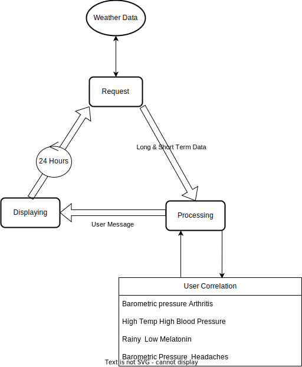

# T Health

T-Health is a mobile app notifying users of their personal health problems associated with future weather changes. Powered by TCore from Tectone23 brings the capabilities of digital identities, scalable cloud infrastructure, and most importantly a web3 mobile OS.

## Weather affects on health

Weather can dictate aspects of human health without knowledge. From arthritis flares, headaches, and mood swings. T-Health allows users to get a head through notifications. As simple as being reminded to go outside before a big storm or to take medicine before a swing in the barometric pressure.

<u>Sources</u>

[Arthritis Foundation](https://www.arthritis.org/health-wellness/healthy-living/managing-pain/understanding-pain/best-climate-for-arthritis#:~:text=Many%20report%20that%20humidity%2C%20along,moving%20to%20drier%2C%20temperate%20climates.)

[Weather On Mental Health](https://www.verywellmind.com/how-weather-changes-can-affect-your-mental-health-5222029#:~:text=Weather%20affects%20our%20moods%2C%20temperaments,cause%20people%20to%20become%20aggressive.)

## Features

### Pushed based notifications 

<b> Request </b>

Only relevant notifications are presented before a change in weather from background processes. Starting with a daily recurring request for both the long & short-term forecast from reputable sources (NOAA public API & Apple Weather Kit).

<b> Processeing </b>

Processing of weather data involves checking correlation between user given health data and app generated data. When a correlation is found a notification will be presented to the user. Notifications display the type of health event and what might help resolve the problem.

<b> Displaying </b>

Notifications will be in basic banner style with a high priority, and messages can be user-defined or presets from within the app.

### Identifying weather based health problems (Time Depending)

Through user engagement the app could identify unknown health problems as personal trends. Finding trends could be as simple as prompting the user on how they felt after a weather event. Anonymous open polls would be the most optimal solution, drawing users to more engaged knowing there not alone when it comes to potential weather based health events. This process should be packaged into Cogs from the TCore suit allowing for scalability and modularity. Additionally adaptive machine learning could be used to feather enhance this user experience.

### Base UX/UI Design

Keeping a simple user interface is key. Revolving around the creation and managing of personal health based notifications (HBN). HBN's will be displayed in a scrolling list view, allowing a user to easily sort and filter. When selected the user will be able to change different aspects of the HBN. This includes adding a custom message, changing weather indicaters and time to notify before the event.

## Potential Shortcomings

### Limited Documentation 

As of now the documentation for the TCore suit is limited, leading to a longer build time. Additionally, this could impact features and overall performances.

### Apple Weather Kit

Apple weather api will be used to access data, formally know as (Darksky). The api is known to be complex and is still a work in progress.
